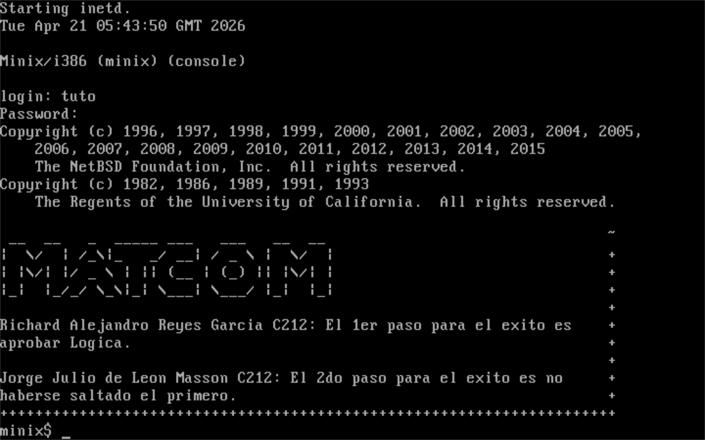

## Integrantes:
Richard Alejandro Reyes Gracia C212
Jorge Julio de Leon Masson C212

# 2. Desarrollo y resultados por componentes
### 2.1. Instalacion y configuracion de minix
**RICHARD**

El emulador que use fue Qemu 10.2.2 usado porque mi computadora es ARM y 
Minix 3.4.0 requiere x86, VirtuaBox no se usó xq este solo virtualiza

2GB de RAM Suficiente para compilar sin lentitud, sin desperdiciar recursos del 
host
1 núcleo de CPU MINIX no requiere más; emular múltiples núcleos en QEMU/ARM 
añade sobrecarga
20GB de disco duro Eepacio suficiente para código fuente y compilaciones; 
formato dinámico ahorra espacio en el host
IPv4 only con DHCP y redirección de pueros (SSH en puerto 7722) modo usuario 
simple, evita problemas de IPv6 en MINIX 3

El 1er emulador que use fue UTM pero no reconoocía la ISO por problemas de 
compatibiliad por lo cual cambiié a Qemu
QEMU dió error "file driver requires regular file" por punto en la ruta 
(richarda.) por lo cual moví los archivos a ~/minix_vm y usar rutas relativas
Error de SSL al hacer git push se arregló desabilitandoverificación SSL con 
git config --global http.sslVerify false 

Herramientas adicionales instaladas
Git: Clonar repositorio oficial (/usr/src) y subir cambios a GitHub
Nano: Editar archivos como /usr/src/etc/motd

**JORGE**

Para crear la maquina virtual decidi usar Qemu ya que hace algun tiempo tuve
probelmas con virtual box sobre mi plataforma linux y he usado desde entonces
qemu para gestionar maquinas virtuales, inicialmente sobre la interfaz grafica
Gnome Boxes, y posteriormente sobre terminal para aprovechar mejor las posibilidades
que ofrece el software.

En primera instancia hice el fork del repositorio del profesor Christopher y lo clone
para intentar compilar mi propia imagen ISO con los archivos de la carpeta /releasetools, 
lo cual no salio nada bien ya que una incompatibilidad de mi compilador de C hizo q fallara
el proceso, asi que no quise romper nada y opte por seguir el proceso descrito por el profesor 
en el video donde explicaba el proceso de instalacion en el cual descargaba su imagen ISO 
directamente desde la pagina oficial de Minix.

Le asigne a la maquina virtual en principio 1 nucleo que es lo que viene por defecto cuando
no se especifica en el comando, aunque posteriormente termine incrementandolo a 4 ya que 
el mismo proyecto de minix al ser tan amplio, hace que comandos relacionados a git como un 
`bash git status` se sientan algo lentos, en memoria asigne 2G de ram, y un disco de 10G.
Tome el comando y lo puse en un archivo al que nombre run_system.sh, al cual asigne permisos
para poder evitar tener que estar buscando el comando cada vez que necesitara ejecutar la maquina.

Como herramientas adicionales una vez terminada de instalar la maquina virtual, agregue nano que 
es un editor con el que estoy algo familiarizado ya que es el que uso con regularidad para ediciones 
rapidas o revisar archivos como por ejemplo los de configuracion de mi sistema. Ademas instale git 
para gestionar el repositorio del proyecto. Ademas estableci una contrasena para el usuario root
y me cree otro usuario.

### 2.2. Personalizacion del mensaje de bienvenida

**JORGE**

En mi caso tuve algunos problemas, ya que a la hora de hacer un push con git, es necesario agregar un 
token de verificacion, y como no se permite, o al menos no conozco como compartir portapapeles entre 
ambas maquinas, me dispuse a activar el servicio ssh para facilitarme el trabajo. En un principio cuando
cree la maquina virtual no me di cuenta de lo siguiente: en el archivo de configuracion dice q el puerto 
por defecto es el 22 pero era necesario mapearlo a un puerto de mi pc, asi q anadi estas lineas que estaban 
en la seccion de ssh de la pagina de la documentacion dedicadas a la virtualizacion con qemu:
'''bash
-net user,hostfwd=tcp::10022-:22 -net nic
'''
Las agregue, arranque el ssh en minix, con una peculiaridad y es que aunque la documentacion brinda este 
comando:
'''bash
/usr/pkg/etc/rc.d/sshd start
'''
Me pidio que usara 'onestart' en lugar de 'start'.

Al intentar conectarme por ssh con normalidad tuve otro problema, y es que al intentar entrar por root
me fallaba la autenticacion, me decia q la contrasena root era incorrecta. Despues de unos cuantos intentos
de romperme la cabeza se me ocurrio intentarlo por el usuario alternativo que me habia creado al crear la vm, 
y entonces me dejo entrar.

