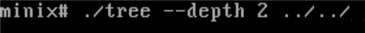
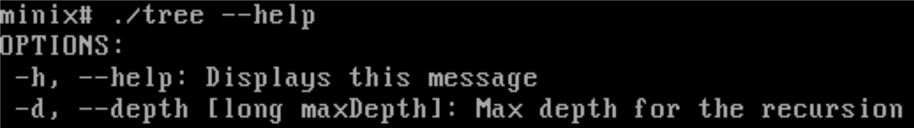
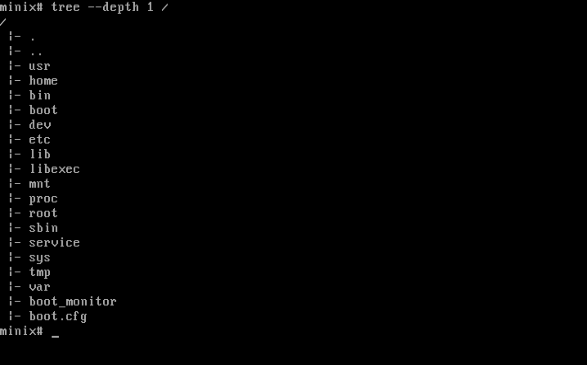

## Integrantes:
Richard Alejandro Reyes Gracia C212
Jorge Julio de Leon Masson C212

# 2. Desarrollo y resultados por componentes
### 2.1. Instalacion y configuracion de minix
**RICHARD**

El emulador que use fue Qemu 10.2.2 usado porque mi computadora es ARM y 
Minix 3.4.0 requiere x86, VirtuaBox no se us贸 xq este solo virtualiza

2GB de RAM Suficiente para compilar sin lentitud, sin desperdiciar recursos del 
host
1 n煤cleo de CPU MINIX no requiere m谩s; emular m煤ltiples n煤cleos en QEMU/ARM 
a帽ade sobrecarga
20GB de disco duro Eepacio suficiente para c贸digo fuente y compilaciones; 
formato din谩mico ahorra espacio en el host
IPv4 only con DHCP y redirecci贸n de pueros (SSH en puerto 7722) modo usuario 
simple, evita problemas de IPv6 en MINIX 3

El 1er emulador que use fue UTM pero no reconooc铆a la ISO por problemas de 
compatibiliad por lo cual cambii茅 a Qemu
QEMU di贸 error "file driver requires regular file" por punto en la ruta 
(richarda.) por lo cual mov铆 los archivos a ~/minix_vm y usar rutas relativas
Error de SSL al hacer git push se arregl贸 desabilitandoverificaci贸n SSL con 
git config --global http.sslVerify false 

Herramientas adicionales instaladas
Git: Clonar repositorio oficial (/usr/src) y subir cambios a GitHub
Nano: Editar archivos como /usr/src/etc/motd

**JORGE**

Para crear la maquina virtual decidi usar Qemu ya que hace algun tiempo tuve
probelmas con virtual box sobre mi plataforma linux y he usado desde entonces
qemu para gestionar maquinas virtuales, inicialmente sobre la interfaz grafica
Gnome Boxes, y posteriormente sobre terminal para aprovechar mejor las posibilidades
que ofrece el software.

En primera instancia hice el fork del repositorio del profesor Christopher y lo clone
para intentar compilar mi propia imagen ISO con los archivos de la carpeta /releasetools, 
lo cual no salio nada bien ya que una incompatibilidad de mi compilador de C hizo q fallara
el proceso, asi que no quise romper nada y opte por seguir el proceso descrito por el profesor 
en el video donde explicaba el proceso de instalacion en el cual descargaba su imagen ISO 
directamente desde la pagina oficial de Minix.

Le asigne a la maquina virtual en principio 1 nucleo que es lo que viene por defecto cuando
no se especifica en el comando, aunque posteriormente termine incrementandolo a 4 ya que 
el mismo proyecto de minix al ser tan amplio, hace que comandos relacionados a git como un 
`bash git status` se sientan algo lentos, en memoria asigne 2G de ram, y un disco de 10G.
Tome el comando y lo puse en un archivo al que nombre run_system.sh, al cual asigne permisos
para poder evitar tener que estar buscando el comando cada vez que necesitara ejecutar la maquina.

Como herramientas adicionales una vez terminada de instalar la maquina virtual, agregue nano que 
es un editor con el que estoy algo familiarizado ya que es el que uso con regularidad para ediciones 
rapidas o revisar archivos como por ejemplo los de configuracion de mi sistema. Ademas instale git 
para gestionar el repositorio del proyecto. Ademas estableci una contrasena para el usuario root
y me cree otro usuario.


### 2.2. Personalizacion del mensaje de bienvenida

**JORGE**

En mi caso tuve algunos problemas, ya que a la hora de hacer un push con git, es necesario agregar un 
token de verificacion, y como no se permite, o al menos no conozco como compartir portapapeles entre 
ambas maquinas, me dispuse a activar el servicio ssh para facilitarme el trabajo. En un principio cuando
cree la maquina virtual no me di cuenta de lo siguiente: en el archivo de configuracion dice q el puerto 
por defecto es el 22 pero era necesario mapearlo a un puerto de mi pc, asi q anadi estas lineas que estaban 
en la seccion de ssh de la pagina de la documentacion dedicadas a la virtualizacion con qemu:
```bash
-net user,hostfwd=tcp::10022-:22 -net nic
```
Las agregue, arranque el ssh en minix, con una peculiaridad y es que aunque la documentacion brinda este 
comando:
```bash
/usr/pkg/etc/rc.d/sshd start
```
Me pidio que usara 'onestart' en lugar de 'start'.

Al intentar conectarme por ssh con normalidad tuve otro problema, y es que al intentar entrar por root
me fallaba la autenticacion, me decia q la contrasena root era incorrecta. Despues de unos cuantos intentos
de romperme la cabeza se me ocurrio intentarlo por el usuario alternativo que me habia creado al crear la vm, 
y entonces me dejo entrar.


### 2.3. Depuraci贸n de un bug en pthread


1. S铆ntomas
Al ejecutar el programa de prueba proporcionado por el profesor, se observ贸 el siguiente comportamiento an贸malo:

La primera llamada a pthread_mutex_trylock retornaba 0 (OK), indicando que el mutex se hab铆a bloqueado correctamente.
La segunda llamada a pthread_mutex_trylock (realizada por el mismo hilo) no retornaba nunca. El programa se quedaba congelado, sin mostrar los mensajes siguientes (unlock, destroy, PASS), y el 
prompt de MINIX no volv铆a a aparecer hasta que se forzaba la interrupci贸n con Ctrl + C.

2. Ana谩lisis
En MINIX, las funciones de hilos se dividen en dos capas. Por un lado, la capa de compatibilidad (archivo libmthread/pthread_compat.c) provee las funciones est谩ndar pthread_* que los 
programadores utilizan. Por otro lado, la implementaci贸n nativa (archivo libmthread/mutex.c) provee las funciones reales mthread_* que manejan los mutex a bajo nivel. La capa de compatibilidad 
act煤a como un traductor: cada funci贸n pthread_* deber铆a llamar a su equivalente mthread_*.

Al inspeccionar pthread_compat.c, se localiz贸 la funci贸n pthread_mutex_trylock y se encontr贸 el siguiente c贸digo: return pthread_mutex_trylock(mutex);

El problema es que la funci贸n se llama a s铆 misma recursivamente en lugar de llamar a mthread_mutex_trylock. Esto es un error tipogr谩fico

3. Correc�i贸n
La soluci贸n es m铆nima: cambiar la llamada recursiva por la llamada a la funci贸n nativa.
Cambiar return pthread_mutex_trylock(mutex); por return mthread_mutex_trylock(mutex);

4. Verificaci贸n
Despu茅s de aplicar la correcci贸n, se recompil贸 la librer铆a y se ejecut贸 nuevamente el programa de prueba.
Soluci贸n obtenid:
first trylock: 0 (OK)
second trylock: 11 (Resource deadlock avoided)
unlock: 0 (OK)
destroy: 0 (OK)
PASS
El programa ya no se congela. La segunda llamada retorna el c贸digo de error esperadoy el programa contin煤a ejecutando unlock, destroy y finalmente imprime PASS.

### 2.4. Implementacion del comando tree


Implemente en el metodo main la siguiente estructura para el manejo de argumentos en la invocacion del programa:

```c

int main(const int argc, char *argv[]) {
    char *firstArg = argc > 1 ? argv[1] : NULL;
    char *secondArg = argc > 2 ? argv[2] : NULL;
    char *thirdArg = argc > 3 ? argv[3] : NULL;
    char *path;
    long depth = -1;

    switch (argParse(firstArg, secondArg)) {
        case 1:
            printHelp();
            return 0;
        case 2:
            maxDepth = strtol(secondArg, NULL, 10);
            path = thirdArg == NULL ? "." : thirdArg;
            break;
        case -2:
            printf("%s\n", "Enter a valid number for depth");
            return 0;
        default:
            path = firstArg == NULL ? "." : firstArg;

    }

    printf("%s\n", path);
    tree(path, 1);
}
```

Se manejan como posibles argumentos :
--depth, -d para la profundidad de la recursion, la cual se maneja en una variable estatica dentro del archivo y sirve como un break extra

```c
static long maxDepth = -1; //-1 significa sin profundidad establecida

y se agrega el siguiente caso base a la funcion

void tree(...){
    ...
    if (depth > maxDepth && maxDepth != -1) {
        return;
    }   
    ...

```



--help, -h que simplemente imprime en pantalla un mensaje de ayuda



el manejo de los argumentos se realiza en una funcion aparte que retorna un entero que se interpreta en el switch mediante una codificacion implementada para interpretar
las configuraciones, mientras que -1*$code equivaldria a un error en el uso de esa opcion:

```c
int argParse(const char *firstArg, const char *secondArg) {

    if (firstArg == NULL) {
        return 0;
    }

    if (strcmp(firstArg, "--help") == 0 || strcmp(firstArg, "-h") == 0) {
        return 1;
    }

    if (secondArg == NULL) {
        return 0;
    }
    if (strcmp(firstArg, "--depth") == 0 || strcmp(firstArg, "-d") == 0) {
        char *endptr;

        long _ = strtol(secondArg, &endptr, 10);

        if (strcmp(endptr, "") != 0) {
            return -2;
        }

        return 2;
    }

    return 0;
}
```


En el metodo se realizan comparaciones pertinentes para retornar un codigo entendible por el switch en main()


Ejemplo de uso:

